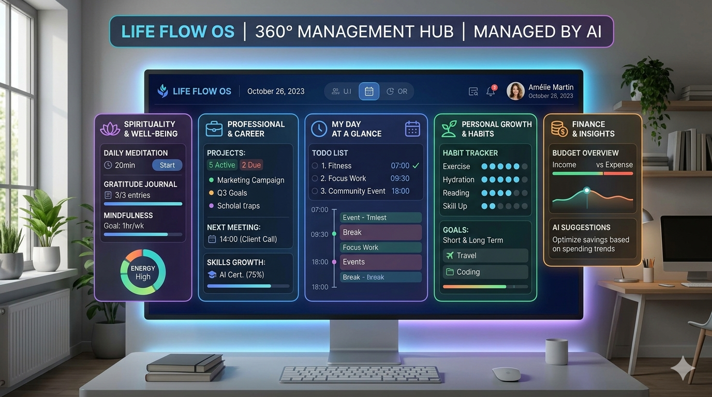

<p align="center">
  
</p>

<h1 align="center">⚡ Aegis Flow — Command Center</h1>

<p align="center">
  <b>Personal management dashboard for elite performance</b><br>
  210 days of intense discipline · SaaS building · Geo-AI mastery · Physical transformation
</p>

<p align="center">
  
  
  
  
  
</p>

---

## 🚀 Overview

Aegis Flow is a 360° daily command center designed for ambitious 210-day programs. It tracks every dimension of elite performance:

- **🙏 Spiritual** — Prayer tracking, Bible reading, fasting streaks
- **📚 Intellectual** — 350 books in 7 months, English C2 immersion
- **💻 SaaS Builder** — MVP development, MRR tracking, 100k customer goal
- **🛰️ Geo-AI** — 28-week self-study roadmap (Python → DL → product)
- **💪 Physical** — Progressive workout quotas (pushups, abs, squats, plank)
- **🏠 Organization** — Daily/weekly/monthly housework tracking
- **📓 Journal** — Tagged entries with full CRUD
- **📊 Analytics** — KPI charts, linear regression projections, productivity correlation
- **⏱️ Pomodoro** — Built-in focus timer with notifications
- **📋 Planning** — Optimized daily schedule (05:00 — 22:00)

---

## 🧩 Tech Stack

| Layer | Technology |
|-------|-----------|
| **Frontend** | React 19, TypeScript 5.9, Vite 7 |
| **Styling** | Tailwind CSS 4, Lucide icons |
| **Charts** | Recharts 3 |
| **State** | Custom store (useSyncExternalStore) + localStorage |
| **Backend** | Express 5, PostgreSQL, InsForge SDK |
| **PWA** | vite-plugin-pwa (offline-first) |
| **AI Providers** | Gemini, DeepSeek, OpenRouter, Fireworks |
| **Testing** | Vitest (25 tests) |

---

## 📁 Project Structure

```
aegis-flow/
├── index.html               # Entry HTML + PWA meta
├── vite.config.ts           # Vite + Tailwind + PWA + singlefile
├── tsconfig.json
├── package.json
│
├── src/                     # Frontend (React SPA)
│   ├── App.tsx              # Main dashboard (8 tabs)
│   ├── main.tsx             # React entry
│   ├── index.css            # Theme system + CSS vars
│   ├── types.ts             # Shared types
│   │
│   ├── components/          # UI components
│   │   ├── AuthModal.tsx
│   │   ├── Journal.tsx
│   │   ├── KanbanBoard.tsx
│   │   ├── PomodoroTimer.tsx
│   │   └── StatsPanel.tsx
│   │
│   ├── api/                 # Frontend API client
│   │   └── insforge.ts
│   │
│   ├── store/               # State management
│   │   ├── simpleStore.ts   # Generic store creator
│   │   ├── taskStore.ts
│   │   ├── journalStore.ts
│   │   ├── statsStore.ts
│   │   └── authStore.ts
│   │
│   ├── services/            # Backend services
│   │   ├── authService.ts
│   │   ├── aiClient.ts
│   │   └── openrouterService.ts
│   │
│   ├── data/                # Static data
│   │   ├── initialData.ts   # Program state + 30 recommended books
│   │   ├── geoaiRoadmap.ts  # 28-week Geo-AI curriculum
│   │   └── quotes.ts        # 131 motivational quotes
│   │
│   ├── utils/               # Utilities
│   │   ├── syncManager.ts   # Local + cloud sync
│   │   ├── stats.ts         # Linear regression, correlation
│   │   └── cn.ts            # Tailwind class merge
│   │
│   └── __tests__/           # Tests (25 total)
│
├── server/                  # Express API server
│   ├── index.ts
│   ├── db.ts
│   ├── tsconfig.json
│   └── routes/
│       ├── books.ts
│       ├── daily.ts
│       ├── geo.ts
│       └── ai.ts
│
└── favicons/                # PWA icons
```

---

## 🛠️ Getting Started

```bash
# Install dependencies
npm install

# Start dev server
npm run dev

# Build for production
npm run build

# Run tests
npm test

# Start API server (requires PostgreSQL)
npm run serve
```

---

## 🎯 Features by Tab

| Tab | Description |
|-----|-------------|
| **Overview** | KPI cards (Discipline, MRR, Clients, Books) + daily discipline grid + pillars |
| **Daily** | Input forms for prayer, Bible, English, Tech, Pitch, Geo-AI + sport quotas + sleep/nutrition + checklist |
| **Tasks** | Kanban board (todo / in_progress / done) with drag-free move |
| **Books** | 30 recommended books + personal library |
| **Geo-AI** | 7-month / 28-week interactive roadmap with progress bars |
| **Journal** | Full CRUD journal with tags and date sorting |
| **Analytics** | Area charts, 30-day linear regression, productivity correlation |
| **Planning** | Optimized daily schedule (05:00 — 22:00) with priority levels |
| **Pomodoro** | 25/5/15 min focus timer with circular progress + browser notifications |
| **Settings** | Theme toggle, AI provider config (4 providers), manual sync |

---

## 🌙 Theme

Supports **dark** (default) and **light** mode with system preference detection and localStorage persistence.

---

## 📊 Tests

```bash
npm test            # 25 tests — 6 test files
npm run lint        # ESLint
npm run format      # Prettier
```

---

## 📄 License

MIT — Built with ❤️ for the 210-day transformation.
